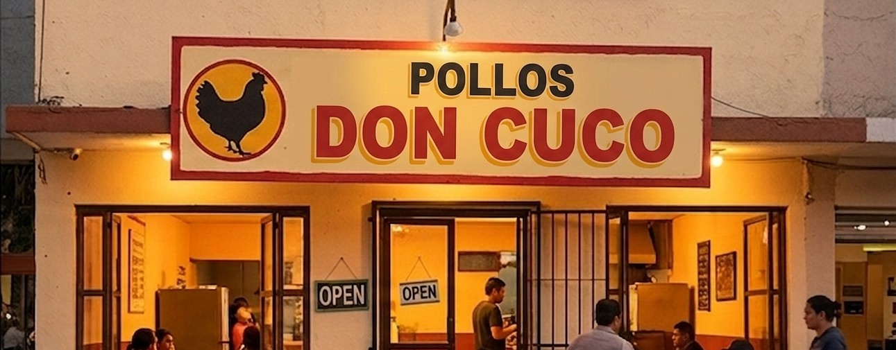

# Don Cuco — Asador de Pollos

Sitio web para que los clientes de Don Cuco, un asador de pollos para llevar en Los Mochis, Sinaloa, conozcan el menú y reserven pedidos.



## Problema / Motivación

El sitio concentra en un solo lugar la historia del negocio, el menú, la ubicación, los horarios y los canales de contacto.
También permite preparar una reserva desde el navegador y transferirla a WhatsApp para su confirmación.

<!-- COMPLETAR: explicar la motivación original del proyecto; no se puede inferir con certeza a partir del código. -->

Este sitio se desarrollo como parte de las práctica de las practicas hechas en el día 2 en la sesión de Agentes que construyen del Bootcamp Vibe Agents.

## Demo

<!-- COMPLETAR: agregar la URL pública de la demo si existe; no hay una URL de producción ni configuración de despliegue en el repositorio. -->

La vista previa disponible en el repositorio es [una fotografía del local](assets/local-hero.jpeg).

Link de muestra del sitio: [don-cuco-talent-team1.vercel.app](https://don-cuco-talent-team1.vercel.app/)

## Stack técnico

- Frontend: HTML5, CSS3 y JavaScript vanilla en un único archivo (`index.html`), con fuentes Fraunces y Nunito Sans cargadas desde Google Fonts.
- Backend: No aplica; el proyecto no contiene servidor ni API.
- Base de datos: No aplica; no se persisten datos.
- Infraestructura/Deploy: Sitio estático; no hay configuración de Docker, CI/CD ni proveedor de despliegue en el repositorio.

## Características principales

- Landing page responsiva con navegación por secciones, menú móvil y animaciones de entrada al hacer scroll.
- Menú con productos y precios en pesos mexicanos, más descarga del menú completo en PDF.
- Formulario de reserva con producto, cantidad, fecha, hora y notas; genera un mensaje para WhatsApp.
- Enlaces directos a dos líneas de WhatsApp y botón flotante de contacto.
- Historia del negocio, fotografías locales, dirección, horario y mapa embebido de Google Maps.

## Cómo correrlo localmente

El proyecto no tiene dependencias que instalar ni variables de entorno. Para servir los archivos localmente:

```bash
git clone https://github.com/liazamudio/web-example-pollos-don-cuco.git
cd web-example-pollos-don-cuco
python -m http.server 8000
```

Después, abre `http://localhost:8000` en el navegador. También puedes abrir `index.html` directamente, aunque el servidor local permite probar el sitio con el mismo esquema de archivos que un hosting estático.

## Decisiones técnicas relevantes

<!-- COMPLETAR: documentar por qué se eligió HTML/CSS/JavaScript vanilla frente a un framework y qué trade-offs se consideraron; no se puede inferir del código. -->

## Estado del proyecto

<!-- COMPLETAR: confirmar si el proyecto está Activo, Mantenido o Archivado y la fecha de última revisión; el historial solo muestra un commit inicial del 19 de agosto de 2026. -->

## Autor / Rol

Alex Zamudio

<!-- COMPLETAR: indicar el rol específico del autor en el proyecto; el nombre se tomó del autor del commit inicial, pero el rol no se puede inferir. -->

## Licencia

Todos los derechos reservados. Este proyecto es un desarrollo propio que forma parte del portafolio de servicios de Alex Zamudio; el código se publica únicamente con fines de exhibición y revisión técnica. Ver [LICENSE](LICENSE) para más detalles.
